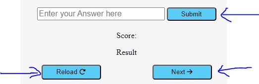
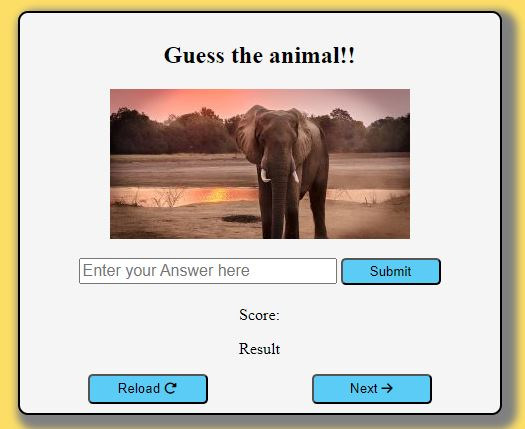
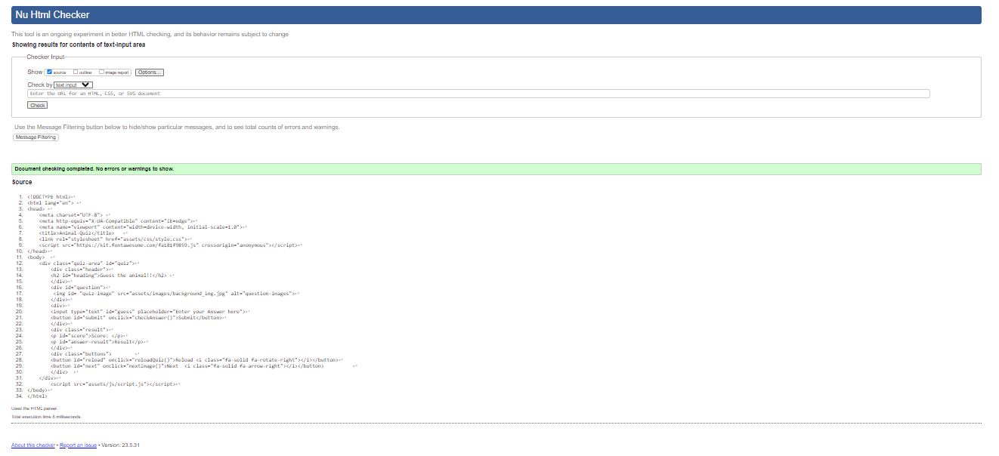
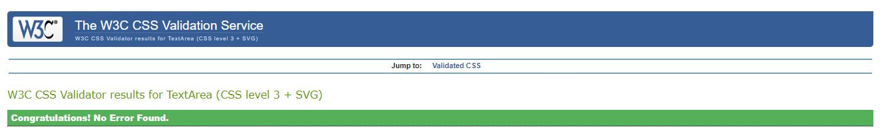
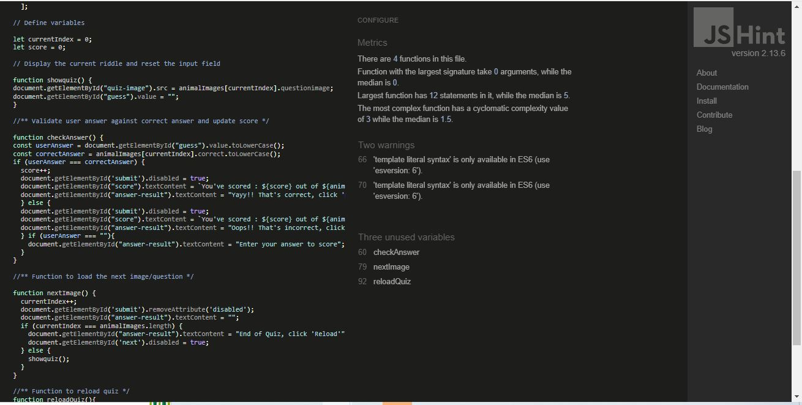

# **Guess the animal quiz**

[Visit the website here](https://msnirmal.github.io/Project2/) 

This website is created for animal lovers and is for users of over 15 and above, however, under 15's can still use with parental guidance and permission to use electronics 

This website is made up of the following sections:

1. Quiz area 
2. Header
3. Animal images 
4. Input text box to enter user answer 
5. Score section 
6. Result section 
7. Submit button 
8. Next button 
9. Reload button 

**Developer Goals** :

1. To help users enable their kids during   
   early years of schooling

2. To encourage users to improve their 
   knowledge base on animals 

3. To help parents engage their kids with      something educative during their term holidays rather than computer games and watching cartoons on TV  

4. To also encourage users to see the beauty of nature with those stunning images of animals 

**User Goals:**

1.	As a first-time visitor, I want an interactive quiz site that is simple and easy to use 

2.	As a first-time visitor, I want to easily navigate through the various questions involved in the quiz

3.	As a first-time visitor, I want to be able to test my knowledge on animals and i want to know when the quiz has ended and what my total score is out of the total no. of questions 

4.	As a first-time visitor, i want the quiz to be self explanatory, rather than having to go through multiple paragraphs of instructions and buttons leading to various other pages and finding my way back

5.	As a first time, i want the quiz to prompt if i am correct or incorrect 

6. As a first time visitor, i want to be able to easily reload the quiz when it has ended or i want to intentionaly pause and launch from the beginning 

## **UX**
---
### **Strategy**

To be in line with UX principles, first i thought  of a strategy to identify who the target users would be and what features they are looking for 

Animal quiz target users are:
* Aged 15 & over (Can be under 15's with parental permission to use electronics)
* Animal lovers 
* People who have passion for nature and its creation  

User requirements:
* Website that's simple and meets the purpose
* Ease of navigation  
* Basic content for the understanding of kids under 15
* To be able to view on all devices 

### **Scope**

* Title header which is self explanatory and navigation links to access various sections of the page 
* Stunning Images of animals in their natural habitat
* Submit button that doesn't allow you click more than once to basically test your knowledge
* Next button to sail through the various questions with ease 
* Reload button to relaunch the quiz once complete, to try again 
* Simple and easy to understand text that states the score out of total questions 
* Interactive result text, which pops whether correct or incorrect  

### **Structure**

This is a single page website that includes quiz area, inside which there's quiz images, input text box, submit button, next button and reload button, sections to show score and result. 

### **Skeletal**

While creating a draft for this website and during the building process, i used different background colors, however, i felt the images that i have used will contrast well with a white background for quiz area and rest of body has yellow to contrast with the neon blue buttons. 

### **Surface**

The overall background of this website is Yellow with white background for quiz area, keeping in mind the colors of the images and the button colors i have used 

## **Features**
---

This website is designed with an intent to encourage users to test their knowledge on animals, it is responsive and has eye catching images of animals in their natural habitat that would enagage the users to explore more. The website is simple, easy to use and meant for purpose with no overwhelming information. 

### *Header*

The header has a basic text that indeed is self explanatory on what's expected off the users 

### *Controls*

The Submit button allows users to submit their answer once they have entered in the text box adjacent to it and the text popping with result point them to clicking Next. Submit button is then disabled 

The Next button when clicked loads the next image and is disabled when the quiz ends

Reload button helps users to reload the quiz

### *Quiz area*

The quiz area is divided in to 8 sections. 

First section is the header to guess the animals  
Second section is the animal image 
Third section is the text box to enter user answer 
Fourth section is the submit button 
Fifth section displays the score 
Sixth section displays the result (correct or incorrect)
Seventh section is the next button 
Eight section is the reload button 

## Technologies Used 

The technologies i have used to create this website are as below-

- [Javascript](https://developer.mozilla.org/en-US/docs/Web/JavaScript)
    - Used for the interactivity of the website
- [HTML](https://developer.mozilla.org/en-US/docs/Web/HTML)
    - Used as the basic building block for the project and to structure the content.
- [CSS](https://developer.mozilla.org/en-US/docs/Learn/Getting_started_with_the_web/CSS_basics)
    - Used to style all the web content across the project. 
- [Font Awesome](https://fontawesome.com/)
    - Used to obtain the next and reload icons for next and reload buttons 
- [Google Developer Tools](https://developers.google.com/web/tools/chrome-devtools)
    - Used as a primary method of fixing spacing issues, finding bugs, and testing responsiveness across the project.
- [GitHub](https://github.com/)
    - Used to store code for the project after being pushed.
- [Gitpod](https://www.gitpod.io/)
    - Used as the development environment.

    ## Testing 
---

### *User Stories*

1. **As a first-time visitor, I want an interactive quiz site that is simple and easy to use**

   The page is made simple keeping in mind users of all age group. As soon as a user launches the page, they can see the quiz area prompting them to guess the animal 

2. **As a first-time visitor, I want to easily navigate through the various questions involved in the quiz**

   The User can easily click the next button to move to next image at their convenience as they are not timed 

3. **As a first-time visitor, I want to be able to test my knowledge on animals and i want to know when the quiz has ended and what my total score is out of the total no. of questions**

   The users have a considerable amount of quiz images to take a tour of the animal world and once the quiz has ended, there's a message that prompts them that they are done and what their final score is

4. **As a first-time visitor, i want the quiz to be self explanatory, rather than having to go through multiple paragraphs of instructions and buttons leading to various other pages and finding my way back**

    The website is designed as simple, so that a school going kid can easily understand, what is expected off them to play the quiz. There's no need to go through multiple pages and several paragraph of instructions 

5. **As a first time, i want the quiz to prompt if i am correct or incorrect**

   I have incuded a section that increments the score for all correct answers as a user traverses through the quiz 

6. **As a first time visitor, i want to be able to easily reload the quiz when it has ended or i want to intentionaly pause and launch from the beginning**

   To the bottom left hand corner of the website i have included reload button with an icon to relaunch the quiz 

   While testing i came across a few bugs as mentioned below- 

   1. **Entering correct answer and clicking the submit button more than once was incrementing the score**

       I have added code to my javascript function to disable the submit button after the first click

   2. **if answer is blank and the user clicks submit validation needs to be done**

       I have added a code to my functions with a comment to let the user know, they have entered a value 

   3. I have come across some responsive issues and working to fix that

   ### **HTML and CSS Validation**
   ---

   I have validated both HTML and CSS codes and no errors found  

   Screenshots below:

   
   

   ### **Javascript code quality check on JSHint**
   ---

       
   
   ## Deployment
---

I deployed this website by using GitPages and following the below steps:

*GitHub pages deployment* 

1. Log in to GitHub
2. In your Repository section, select the project repository that you want to deploy
3. In the menu located at the top of this section, click 'Settings'
4. Select 'Git hub Pages' on the left-hand side menu
5. In the source section, select branch 'main' and save
6. The page then gives a URL, which in the case of this website is  https://msnirmal.github.io/Project2/

## Credits
---

* I have taken ideas from peers and their design during the intial phase of planning the structure. Apart from that i have followed the love math walk through project to get an idea how the look and feel should be 

* I have been watching some youtube videos like coding with nick to understand how a quiz website is generally designed 

* I have also referred to w3schools (https://www.w3schools.com/), stackoverflow (https://stackoverflow.com/), coding ninja (https://www.codingninjas.com/) and coding artist (https://codingartistweb.com/), while working to sort the interactivity of various sections of the website 

## Acknowledgements 
---

Thanks to my mentor Harry Dhillon for the support and sharing his thoughts 